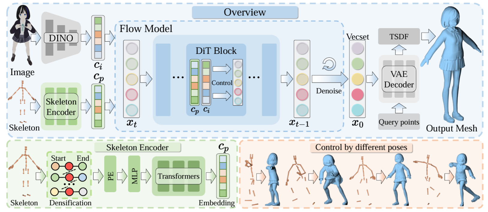

### <div align="center">PoseMaster: A Unified 3D Native Framework for Stylized Pose Generation<div>
#### <div align="center">(CVPR 2026)<div>
##### <p align="center">Hongyu Yan, Kunming Luo, Weiyu Li, Kaiyi Zhang, Yixun Liang, Jingwei Huang, Chunchao Guo, Ping Tan</p>
<div align="center">
  <a href="https://arxiv.org/abs/2506.21076">Paper (arXiv)</a> &ensp;
</div>

# ✨ News
- PoseMaster is accepted to CVPR 2026.
- Code, checkpoints, demo, and data processing pipeline are coming soon.

# 💪 ToDo List
- [ ] inference code (coming soon)
- [ ] training code (coming soon)
- [ ] Gradio & Hugging Face demo (coming soon)
- [ ] Model ckpt (coming soon)
- [ ] data processing rendering (coming soon)

# Introduction
This repository contains the codebase for **PoseMaster: A Unified 3D Native Framework for Stylized Pose Generation (CVPR 2026)**.

PoseMaster unifies pose stylization and 3D generation within a cohesive 3D-native framework. Instead of using 2D skeleton images as guidance, it directly conditions on **3D skeletons** to better capture 3D spatial and topological relationships. We also build a scalable data engine to construct large-scale **Image-Skeleton-Mesh** triplets, enabling joint learning of identity preservation and geometric alignment. The strict spatial alignment between generated 3D meshes and conditioning skeletons makes PoseMaster especially suitable for generating animatable assets when combined with automated skinning models.

<p align="center">
  
</p>

<!-- # Environment Setup
We provide a dependency list under `docker/requirements.txt`.

```bash
conda create -n PoseMaster python=3.10 -y
conda activate PoseMaster
pip install torch==2.5.1 torchvision==0.20.1
pip install -r docker/requirements.txt
```

# Inference
For single-image inference, see:

```bash
python inference.py --help
python inference_image.py --help
```

# Training
Training entrypoint:

```bash
python train.py --help
```

Example configs:
- `configs/image-to-shape-diffusion/hunyuan3d-bone-query-256-lr1e5-freeze-skeleton.yaml`
- `configs/image-to-shape-diffusion/hunyuan3d-2.1.yaml`

# Gradio Demo
We provide a Gradio demo:

```bash
python gradio_app.py --help
```

# Data Processing & Rendering
We include data processing and rendering scripts under:
- `data_processing/`
- `data_processing/render/`
- `scripts/skeleton_render.py` -->

# 📖 BibTeX

    @article{yan2025posemaster,
    title={Posemaster: Generating 3d characters in arbitrary poses from a single image},
    author={Yan, Hongyu and Luo, Kunming and Li, Weiyu and Liang, Yixun and Li, Shengming and Huang, Jingwei and Guo, Chunchao and Tan, Ping},
    journal={arXiv preprint arXiv:2506.21076},
    year={2025}
    }